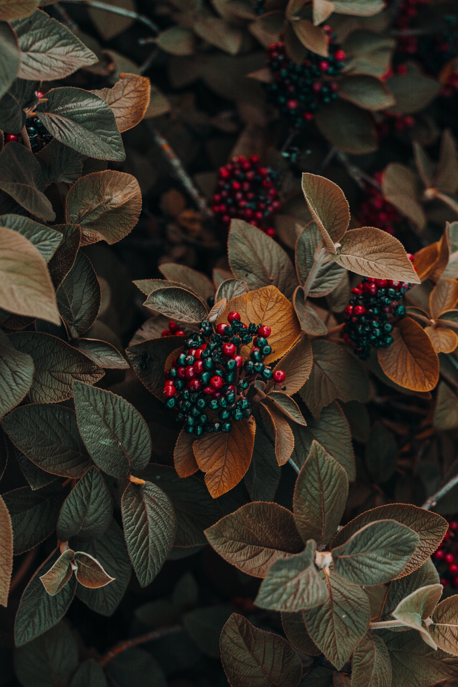
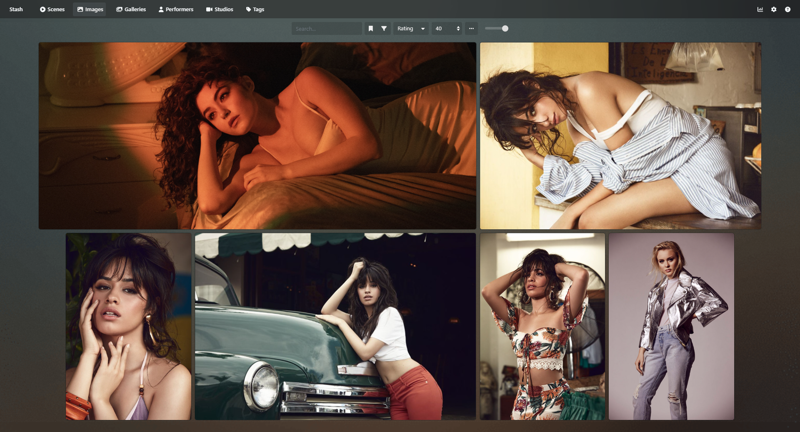

# Stash Stuffs

**Stuffs I made for Stash app**

### Installation

Go to [Settings => Plugins => Available Plugins](http://localhost:9999/settings?tab=plugins) and click `Add Source`, And fill the popup with these values:

1. Name: `Tetrax Repo`
2. Source URL: `https://tetrax-10.github.io/stash-stuffs/release/index.yml`
3. Local Path: `tetrax-repo`

## Plugins

### 1. Play videos instead of previews

Play videos instead of previews when hovered over scene cards. This works on mobile too.

### 2. Replace Thumbnails With High-Res Images

Replaces thumbnails with original high res images in Galleries, Images and Performer tab.

You can see the difference in sharpness, details and colors.

<table>
  <tr align="center">
    <td>Default Thumbnail</td>
     <td>Replaced Image by the plugin</td>
  </tr>
  <tr>
    <td></td>
    <td></td>
  </tr>
  <tr>
    <td></td>
    <td></td>
  </tr>
</table>

 

## Themes

### 1. Plex Better Styles

A modified version of [Stash-Plex theme](https://docs.stashapp.cc/user-interface-ui/themes/plex/) which was originally developed by [Fidelio](https://github.com/f1delio).

**Modifications**:

1. Better **image**, **gallery** cards (flexible according to different aspect ratio)
2. Fixed UI bugs (toolbar, settings, etc...)
3. Uniform Colors (tags, links, settings cards, etc...)

### Galleries

### Performers

### Images

### Scenes

### Settings

### Help

### Tags

