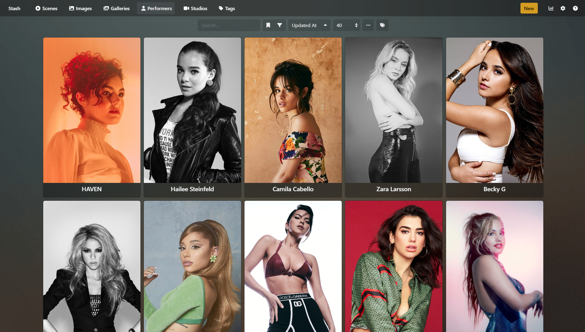

# Stash Stuffs

**Stuffs I made for Stash app**

## Plugins

**Installation**: Download this Repository from [here](https://codeload.github.com/Tetrax-10/stash-stuffs/zip/refs/heads/main). Now copy the respective plugin you want to install and paste them in your [Stash plugin folder](https://docs.stashapp.cc/add-ons/plugins/), Restart Stash app. Done 🎉.

### 1. Play videos instead of previews

Play videos instead of previews when hovered over scene cards. This works on mobile too.

</img>

### 2. Replace Thumbnails With High-Res Images

Replaces thumbnails with original high res images in Galleries, Images and Performer tab

<table>
  <tr align="center">
    <td>Default Thumbnail</td>
     <td>Replaced Image by the plugin</td>
  </tr>
  <tr>
    <td></td>
    <td></td>
  </tr>
</table>

 

## Themes

### 1. Plex Better Styles Theme

A modified and maintained version of [Plex theme](https://docs.stashapp.cc/user-interface-ui/themes/plex/) developed by Stash developers.

**Modifications**:

1. Better **image**, **gallery** cards (flexible according to different aspect ratio)
2. Fixed UI bugs (toolbar, settings, etc...)
3. Uniform Colors (tags, links, settings cards, etc...)

</img>
</img>
</img>
</img>
